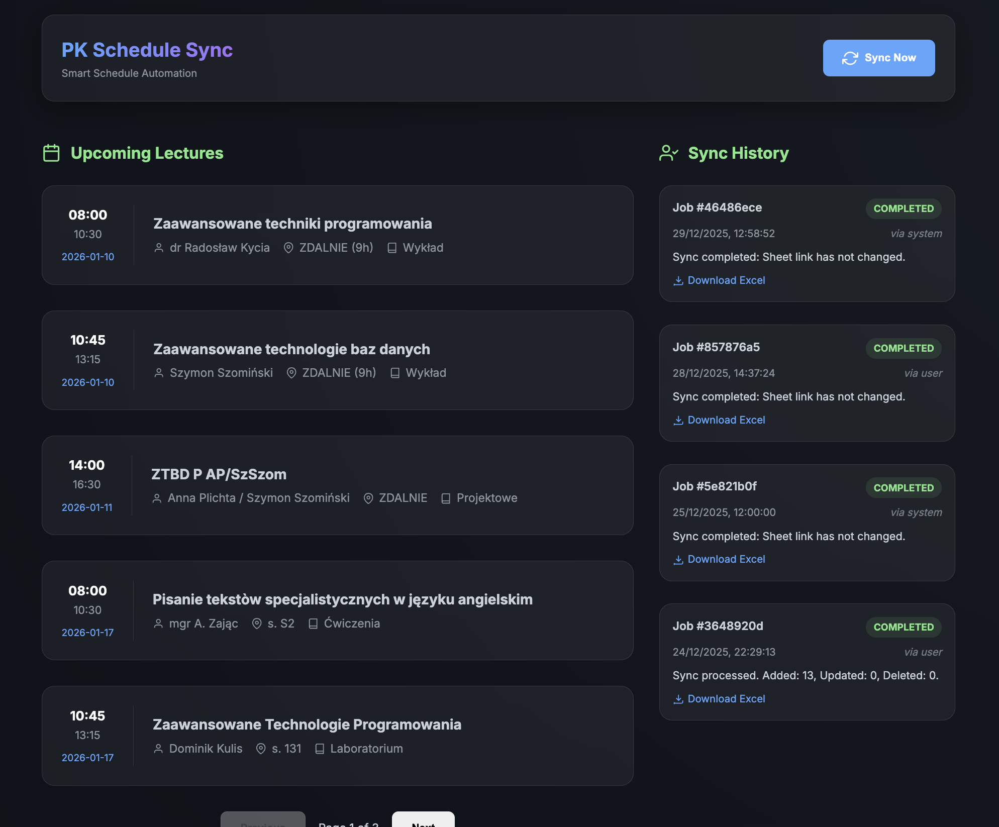

# PK Schedule Sync 🚀

PK Schedule Sync is an intelligent backend system designed to automatically synchronize student schedules from the Politechnika Krakowska (PK) website to a structured database, enriched with AI-powered data parsing.

## 📖 Documentation

Explore the detailed documentation to get started:

- 🛠️ **[Installation & Setup](docs/INSTALLATION.md)**: How to get the project running.
- 🌟 **[Features & Screenshots](docs/FEATURES.md)**: Detailed feature list and visual gallery.
- 📡 **[API Reference](docs/API.md)**: Documentation for technical integration.

## 🛠️ Tech Stack

- **Backend**: Python 3.12+, FastAPI, SQLAlchemy
- **Data Processing**: Pandas, OpenPyxl, xlrd
- **AI Integration**: Ollama (local local LLM instance)
- **Scraping**: HTTPX, BeautifulSoup4
- **Database**: SQLite
- **Notifications**: Slack API
- **Calendar**: Google Calendar API

## 📝 Roadmap & Notes

Check `NOTES.md` for upcoming features and development logs.