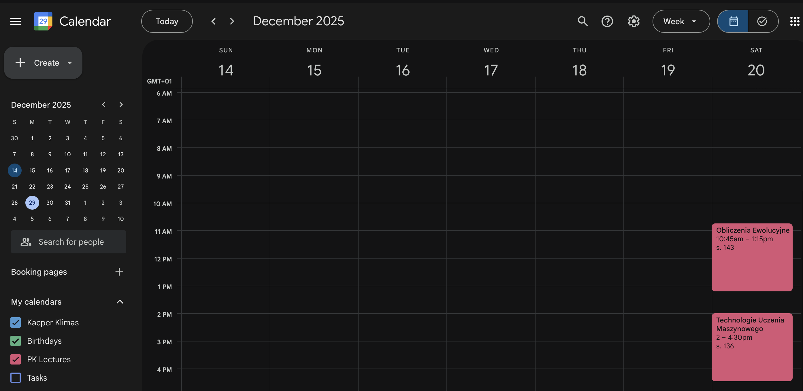
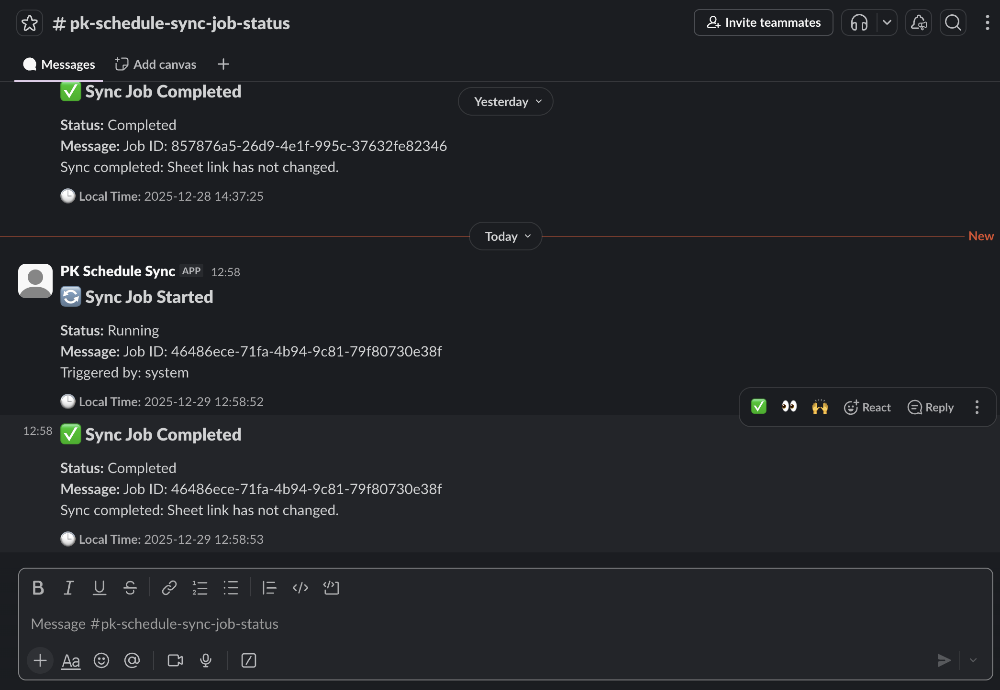
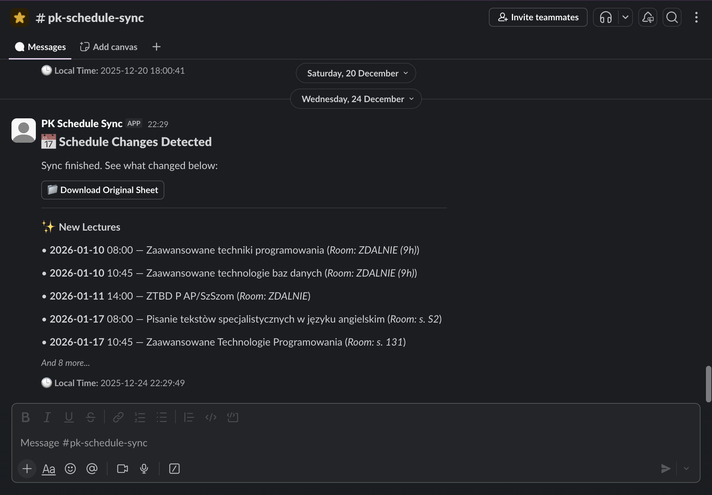

# Features and Integration 🌟

PK Schedule Sync provides a robust set of features to automate and enrich student schedule management.

## 🚀 Key Features

### 🏢 Core Functionality
- **Automated Web Scraping**: Periodically checks the PK faculty page for the latest schedule spreadsheets.
- **Smart Change Detection**: Only processes updates when a new file version is detected.
- **Batch Synchronization**: High-performance database updates for large datasets.

### 🧠 AI Enrichment (Ollama)
The system uses a local LLM to transform cryptic schedule strings into structured data.
- **Example**: `"OE P WK s. 143"` → `{subject: "Obliczenia Ewolucyjne", type: "Projektowe", teacher: "Adam Nowak", room: "s. 143"}`

### 📅 Google Calendar Integration
Automatically syncs your schedule to Google Calendar for easy access on any device.

### 💬 Slack Notifications
Stay informed about synchronization jobs and schedule changes directly in Slack.

| Job Status Notifications | Schedule Sync Notifications |
| :---: | :---: |
|  |  |

## 🖥️ User Interface
The project includes a clean web interface to monitor sync logs and view paged lecture data.

